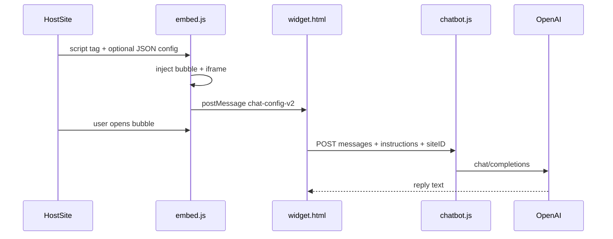

# Architecture

chat-widget is a drop-in embeddable GPT chat assistant for any website. Host sites load a single script; the widget runs in an isolated iframe and calls a serverless proxy for OpenAI.

## System overview

## Components

| Component | Path | Responsibility |
|-----------|------|----------------|
| Embed loader | `public/embed.js` | Parse config, render floating button, create iframe, host-page JS API |
| Widget UI | `public/widget.html` | Tabbed chat UI, API calls, session persistence |
| Chat API | `netlify/functions/chatbot.js` | OpenAI proxy, rate limiting, per-site logging |
| Advanced setup | `public/advanced/index.html` | Interactive config generator |
| Examples | `public/examples/*.html` | Vertical demo pages |

## Deployment

- **Static assets:** `public/` published by Netlify
- **Functions:** `netlify/functions/` bundled with esbuild
- **Production:** https://chat-widget.uft1.com
- **Local dev:** `netlify dev` — static on port `52873`, functions on `3999`

## Config flow

1. Host page includes optional `<script type="application/json" id="chat-widget-config">` block.
2. `embed.js` reads config from known element IDs and merges with defaults.
3. On iframe load, embed sends `postMessage({ type: 'chat-config-v2', payload })` to `widget.html`.
4. Widget applies theme, tabs, links, and instructions.

Supported config element IDs (first match wins):

- `chat-widget-config` (canonical)
- `chat-config-advanced-v2`
- `chat-config-advanced`
- `chat-config`

## Message protocol

Parent (`embed.js`) ↔ iframe (`widget.html`):

| Type | Direction | Purpose |
|------|-----------|---------|
| `chat-config-v2` | parent → iframe | Full widget config payload |
| `chat-focus-input` | parent → iframe | Focus chat input when opened |
| `chat-advanced-expand-state` | parent → iframe | Sync full-page mode |
| `chat-advanced-v2-expand` | iframe → parent | Request expand/collapse |

## Security boundaries

- **OpenAI API key** lives only in Netlify environment (`OPENAI_API_KEY`). Never sent to the browser.
- **Instructions and messages** travel client → function → OpenAI.
- **postMessage** uses origin validation where possible (see ADR 004).
- **Rate limiting** on the function protects the shared API key (see `chatbot.js`).

## Legacy routes

Canonical paths:

- `/embed.js`
- `/widget.html`

Legacy shims redirect or re-load canonical assets:

- `/v1/embed.js`, `/v2/embed.js` → inject `/embed.js`
- `/v1/*`, `/v2/*` HTML pages → redirect to `/` or `/widget.html`

## Extension points

Future additions can hook into:

- **Config payload** — new fields in `chat-config-v2` (e.g. `includePageContext`, `autoOpen`)
- **Host API** — `window.ChatWidget.open()`, `.close()`, `.toggle()`
- **Function body** — `siteID` logging, model env var, streaming endpoint
- **Custom `apiUrl`** — self-hosted backend (Phase 4, not yet implemented)

## Related docs

- [Embedding guide](./embedding-guide.md)
- [Config reference](./config-reference.md)
- [Development](./development.md)
- [Architecture decisions](./decisions/README.md)
